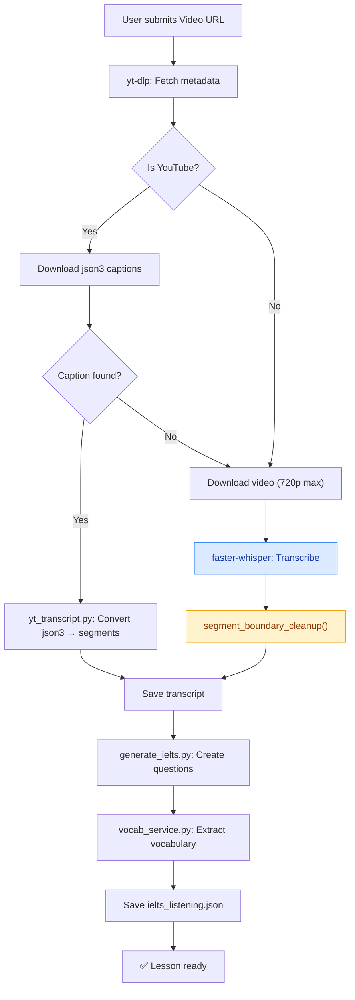

# ToolEV — AI-Powered Video-to-Language Mastery Platform

> **4-in-1 EdTech System**: Dictation · IELTS Exam · Sentence Reordering · Smart Vocabulary  
> Local-first architecture — no cloud dependency for core features

---

## Table of Contents

- [Architecture Overview](#architecture-overview)
- [Tech Stack](#tech-stack)
- [Feature Matrix](#feature-matrix)
- [Pipeline Flow](#pipeline-flow)
- [Segment Boundary Cleanup (Audio-Text Alignment)](#segment-boundary-cleanup)
- [API Reference](#api-reference)
- [Setup & Installation](#setup--installation)
- [Configuration](#configuration)
- [Error Handling & Resilience](#error-handling--resilience)
- [Internationalization (i18n)](#internationalization-i18n)
- [Deployment](#deployment)

---

## Architecture Overview

```
┌─────────────────────────────────────────────────────────┐
│                    Browser (SPA)                         │
│  all-video.html — Single-file UI with 4 learning modes  │
│  ┌──────────┐ ┌──────────┐ ┌──────────┐ ┌────────────┐ │
│  │Dictation │ │IELTS Exam│ │Sentence  │ │Smart Vocab │ │
│  │  Mode    │ │  Mode    │ │Reorder   │ │  Popover   │ │
│  └──────────┘ └──────────┘ └──────────┘ └────────────┘ │
│  i18n Toggle (🇻🇳 VI ↔ 🇺🇸 EN)                         │
└───────────────────────┬─────────────────────────────────┘
                        │ HTTP (localhost:8000)
┌───────────────────────▼─────────────────────────────────┐
│                  server.py (Python)                       │
│  ThreadedHTTPServer + REST API                           │
│  ┌──────────┐ ┌──────────┐ ┌──────────┐ ┌────────────┐ │
│  │/api/     │ │/api/     │ │/api/     │ │/api/       │ │
│  │process   │ │translate │ │vocab     │ │videos      │ │
│  └────┬─────┘ └──────────┘ └──────────┘ └────────────┘ │
└───────┤─────────────────────────────────────────────────┘
        │ Background Thread
┌───────▼─────────────────────────────────────────────────┐
│              pipeline.py (Processing Engine)              │
│                                                           │
│  1. yt-dlp metadata fetch                                │
│  2. YouTube caption extraction (yt_transcript.py)        │
│  3. Whisper Local STT fallback (transcribe.py)           │
│     └─ segment_boundary_cleanup() ← Audio-Text Alignment│
│  4. IELTS question generation (generate_ielts.py)        │
│  5. Vocabulary extraction (vocab_service.py)             │
└─────────────────────────────────────────────────────────┘
```

ToolEV runs **entirely locally** — the Python server serves both the web UI and processes videos. No data leaves the user's machine unless the optional Gemini API key is configured for IELTS question generation.

---

## Tech Stack

| Layer | Technology | Purpose |
|-------|-----------|---------|
| **Frontend** | Vanilla HTML/CSS/JS (Single File) | Zero-dependency UI, works offline |
| **Backend** | Python `http.server` + ThreadingMixIn | Lightweight local server |
| **Speech-to-Text** | `faster-whisper` (CTranslate2) | Local Whisper inference, CPU/GPU |
| **Video Download** | `yt-dlp` | YouTube & 1000+ site support |
| **Audio Processing** | `ffmpeg` / `ffprobe` | Media manipulation, splitting |
| **AI Generation** | Google Gemini API (optional) | IELTS question generation |
| **NLP** | Offline heuristic engine | Fallback IELTS generator |
| **i18n** | Custom JS `data-i18n` system | Vietnamese ↔ English UI toggle |

---

## Feature Matrix

| Feature | Description | Status |
|---------|-------------|--------|
| **Dictation Mode** | Listen → type → auto-check with transcript | ✅ Production |
| **IELTS Listening Exam** | Multiple choice, sentence completion, short answer | ✅ Production |
| **Smart Vocabulary Popover** | Click any word → instant translation + IPA + save | ✅ Production |
| **Vocabulary Hub** | Flashcards (3D flip) + Quiz + CSV export | ✅ Production |
| **YouTube Caption Extraction** | Auto-download json3 captions, no Whisper needed | ✅ Production |
| **Whisper Local STT** | Offline speech recognition with model fallback | ✅ Production |
| **Segment Boundary Cleanup** | Fix word bleed-over between transcript segments | ✅ Production |
| **Language Toggle (i18n)** | Switch entire UI between Vietnamese and English | ✅ Production |
| **Auto-split Long Audio** | Videos >10min split into 5min chunks for Whisper | ✅ Production |
| **Model Fallback Chain** | large → medium → small → tiny automatic fallback | ✅ Production |

---

## Pipeline Flow



---

## Segment Boundary Cleanup

### Problem

Whisper STT frequently produces segments where words "bleed" across sentence boundaries:

```
Segment A: "The weather is really nice today and"
Segment B: "and tomorrow will be even better"
                                          ↑ word "and" duplicated
```

Other issues:
- **Timestamp overlap**: `seg[i].end > seg[i+1].start`
- **Micro-segments**: Fragments with 1 word and <0.5s duration
- **Trailing word duplication**: Last 1-3 words of sentence A appear at the start of sentence B

### Solution: `segment_boundary_cleanup()`

Located in [`transcribe.py`](scripts/transcribe.py), this function performs a **3-pass cleanup**:

#### Pass 1 — Timestamp Overlap Fix
```python
for i in range(len(segments) - 1):
    if segments[i]["end"] > segments[i + 1]["start"]:
        segments[i]["end"] = segments[i + 1]["start"]
```
Clips overlapping `end` timestamps to match the next segment's `start`.

#### Pass 2 — Trailing/Leading Word Deduplication
```python
# Check if last 1-3 words of segment A match first 1-3 words of segment B
for k in range(1, min(4, len(words_a), len(words_b))):
    tail_a = normalize(words_a[-k:])
    head_b = normalize(words_b[:k])
    if tail_a == head_b:
        # Remove duplicate from start of segment B
        segment_b.text = " ".join(words_b[k:])
```

Uses case-insensitive, punctuation-stripped comparison to catch matches like:
- `"today."` vs `"Today"` → match ✅
- `"world!"` vs `"world"` → match ✅

#### Pass 3 — Micro-segment Merge
```python
if word_count < 2 and duration < 0.5:
    # Merge into previous segment
    prev_segment.text += " " + current.text
    prev_segment.end = current.end
```

Fragments too short to stand alone are absorbed into the preceding segment.

### Where It Runs

| Stage | Applied? |
|-------|----------|
| Single file transcription | ✅ After `model.transcribe()` |
| Multi-part merge (audio >10min) | ✅ After all parts are concatenated |
| YouTube caption conversion | ❌ Not needed (YouTube captions are pre-segmented) |

---

## Whisper High-Performance STT Engine

When videos do not have YouTube auto-captions, ToolEV invokes its local `faster-whisper` STT engine. The engine is tuned for maximum inference speed and stability across consumer hardware:

1. **Greedy 1-Beam Decoding (`beam_size=1`)**:
   - Reduces decoding search complexity by 4x–5x compared to standard beam search.
   - Provides near-identical transcription accuracy for English and Vietnamese educational content while executing up to 15x faster.
2. **Hallucination & Repetition Suppression**:
   - `condition_on_previous_text=False`: Prevents infinite repetition loops on instrumental intros, background music, or guitar solos.
   - `no_speech_threshold=0.6` & `compression_ratio_threshold=2.4`: Automatically bypasses non-vocal audio segments.
3. **Proactive CUDA Verification & Zero-Hang CPU Fallback**:
   - `_load_whisper_model()` performs a 0.05s tensor verification before confirming GPU readiness.
   - If NVIDIA drivers report a GPU but CUDA DLLs (`cublas64_12.dll`) are missing, it instantly catches the failure in under 0.5s and seamlessly transitions to CPU without freezing or crashing.
4. **All-Core CPU Parallelism**:
   - Explicitly allocates `cpu_threads=max(4, os.cpu_count())` to harness all physical/logical processor cores.
5. **Live Sentence-Level Progress Streaming**:
   - Ingests `progress_cb` directly into the segment generator.
   - Dispatches real-time percentage updates (50% → 70%) along with the latest transcribed sentence to the browser modal every ~0.6 seconds.

---

## API Reference

### `POST /api/process`
Create a new lesson from a video URL.

```json
{
  "url": "https://www.youtube.com/watch?v=...",
  "language": "en",
  "max_vocab": "15"
}
```

**Response**: `{ "task_id": "uuid", "status": "running" }`

### `GET /api/status?task_id=<uuid>`
Poll processing progress.

```json
{
  "task_id": "uuid",
  "status": "running|completed|error",
  "percent": 50,
  "step": "Whisper Local STT",
  "logs": ["[20:25:57] Đang chạy mô hình AI..."],
  "result": { "slug": "lesson_name", "title": "..." },
  "error": null
}
```

### `GET /api/videos`
List all processed lessons.

### `GET /api/translate?q=word&context=sentence`
Look up a word translation (English → Vietnamese).

### `POST /api/translate/batch`
Batch translate multiple words.

```json
{ "words": ["hello", "world", "language"] }
```

### `POST /api/vocab/save`
Save a word to the vocabulary book.

### `GET /api/vocab?status=all&slug=all`
Retrieve saved vocabulary items.

### `GET /api/vocab/export?format=csv`
Export vocabulary as CSV file.

### `POST /api/delete`
Delete a lesson by slug.

```json
{ "slug": "lesson_name" }
```

### `GET /api/logs?lines=200`
Retrieve recent log lines (JSON format) with log file metadata.

### `GET /api/logs/raw`
Retrieve raw text of `toolev.log` for direct browser viewing or debugging.

### `POST /api/logs/clear`
Clear the server log file.

---

## Setup & Installation

### Prerequisites
- Python 3.10+
- ffmpeg & ffprobe (place in `bin/` or install globally)
- yt-dlp (`pip install yt-dlp`)

### Quick Start

```bash
# 1. Clone the repository
git clone https://github.com/Danhiel1/ToolEV.git
cd ToolEV

# 2. Create virtual environment
python -m venv scripts/.venv
scripts\.venv\Scripts\activate  # Windows
# source scripts/.venv/bin/activate  # Linux/macOS

# 3. Install dependencies
pip install -r scripts/requirements.txt
pip install faster-whisper  # For local STT

# 4. (Optional) Set Gemini API key for AI-powered IELTS questions
set GEMINI_API_KEY=your_api_key_here

# 5. Start the server
python server.py --open
# → Opens http://localhost:8000/all-video.html
```

### Using the Portable Build

```bash
python build_package.py   # Creates dist/ with standalone package
cd dist/ToolEV
run.bat                   # Launches server + opens browser
```

---

## Configuration

| Variable | Default | Description |
|----------|---------|-------------|
| `GEMINI_API_KEY` | _(none)_ | Google Gemini API key for AI question generation |
| `SPLIT_THRESHOLD_SEC` | `600` | Audio longer than this (10min) triggers auto-split |
| `SPLIT_PART_SEC` | `300` | Each split part duration (5min) |
| Server port | `8000` | Auto-increments if port is busy |

### Whisper Model Fallback Chain

```
Requested model → Fallback chain
─────────────────────────────────
large-v3-turbo → medium → small → tiny
medium         → small → tiny
small          → tiny
tiny           → (no fallback, raise error)
```

---

## Error Handling, Logging & Resilience

### Centralized Logging Architecture (`scripts/logger.py`)

- **Log File**: `toolev.log` in workspace root.
- **Handler**: `RotatingFileHandler` (UTF-8, 5 MB max per file, 3 backups) + stream handler to stderr.
- **Uncaught Exception Traps**:
  - `sys.excepthook` captures uncaught errors in the main process.
  - `threading.excepthook` catches background worker crashes.
- **Log Format**: `[%(asctime)s] [%(levelname)s] [%(name)s:%(lineno)d] - %(message)s`
- **Inspection Endpoints**: `/api/logs` (JSON) and `/api/logs/raw` (plain text in browser).
- **Desktop Tray Integration**: Right-click System Tray icon → "📋 Xem nhật ký lỗi (toolev.log)".

### Whisper STT Errors & Resilience

| Error Type | Handling |
|-----------|---------|
| `ImportError` | Clear message: "Install faster-whisper", logged to `toolev.log` |
| `MemoryError` | Automatic fallback to smaller model (large → medium → small → tiny) |
| `RuntimeError` | Detailed traceback captured and logged |
| Model load failure | Try next model in fallback chain |
| Transcribe timeout | Caught and reported with full context |

### Pipeline Error Reporting & Diagnostics

1. Detailed stack traces (`traceback.format_exc()`) captured and logged to `toolev.log`.
2. Reported via `progress_cb` to the live polling modal.
3. Stored in the task's `error` and `traceback` fields.
4. UI displays red error status with a "📋 Xem nhật ký lỗi chi tiết (System Logs)" button.

### Interactive Dictionary Sound Behavior

- Clicking any word in transcripts/text displays the dictionary popover **without** auto-playing speech.
- Audio pronunciation is triggered on-demand only when clicking the speaker button (🔊 `wpAudioBtn`).

---

## Internationalization (i18n)

### Architecture

```javascript
// Dictionary-based i18n with data attributes
const I18N = {
  vi: { addVideo: 'Thêm video', ... },
  en: { addVideo: 'Add video', ... }
};

// HTML elements use data-i18n attribute
<span data-i18n="addVideo">Thêm video</span>

// applyLanguage() swaps all text instantly
function applyLanguage(lang) {
  document.querySelectorAll('[data-i18n]').forEach(el => {
    el.textContent = I18N[lang][el.getAttribute('data-i18n')];
  });
}
```

### Supported Elements

| Element Type | Attribute | Example |
|-------------|-----------|---------|
| Text content | `data-i18n="key"` | `<span data-i18n="addVideo">` |
| Placeholder | `data-i18n-placeholder="key"` | `<input data-i18n-placeholder="searchPlaceholder">` |
| Dynamic JS strings | `t('key')` function | `alert(t('alertNoUrl'))` |

### Language Preference
- Stored in `localStorage` key: `toolev_lang`
- Default: `vi` (Vietnamese)
- Toggle button in header: `🇻🇳 VI | 🇺🇸 EN`

---

## Deployment

### Local Development
```bash
python server.py          # http://localhost:8000
python server.py --open   # Auto-opens browser
python server.py 3000     # Custom port
```

### Portable Package
```bash
python build_package.py   # Creates dist/ToolEV/
```

The portable package includes:
- `server.py` + all scripts
- `all-video.html` (single-file UI)
- `bin/` (ffmpeg, ffprobe)
- `run.bat` (Windows launcher)
- `stop.bat` (graceful shutdown)

### System Requirements

| Component | Minimum | Recommended |
|-----------|---------|-------------|
| RAM | 4 GB | 8 GB+ |
| Storage | 500 MB | 2 GB (for Whisper models) |
| GPU | Not required | NVIDIA CUDA for fast STT |
| Python | 3.10 | 3.11+ |
| Browser | Chrome 90+ | Chrome/Edge latest |

---

## File Structure

```
ToolEV/
├── server.py                    # HTTP server + API endpoints
├── all-video.html               # Single-file SPA (UI + CSS + JS)
├── TOOLEV_HARNESS.md            # This documentation
├── build_package.py             # Portable build script
├── run.bat / stop.bat           # Windows launchers
├── scripts/
│   ├── pipeline.py              # Video processing pipeline
│   ├── transcribe.py            # Whisper STT + segment cleanup
│   ├── yt_transcript.py         # YouTube caption converter
│   ├── generate_ielts.py        # IELTS question generator
│   ├── vocab_service.py         # Translation + vocabulary service
│   ├── build_full_document.py   # Competition pitch document builder
│   └── requirements.txt
├── output/                      # Processed lessons (per-slug dirs)
│   └── <slug>/
│       ├── video.mp4
│       ├── thumb.jpg
│       ├── ielts_listening.json
│       └── parts/
│           └── part_000_transcript.json
└── bin/                         # Bundled ffmpeg/ffprobe
```

---

*Generated by ToolEV Harness AI Documentation System*  
*Author: Danhiel1 • Contact: nguyenminhhieu.stu@gmail.com*
